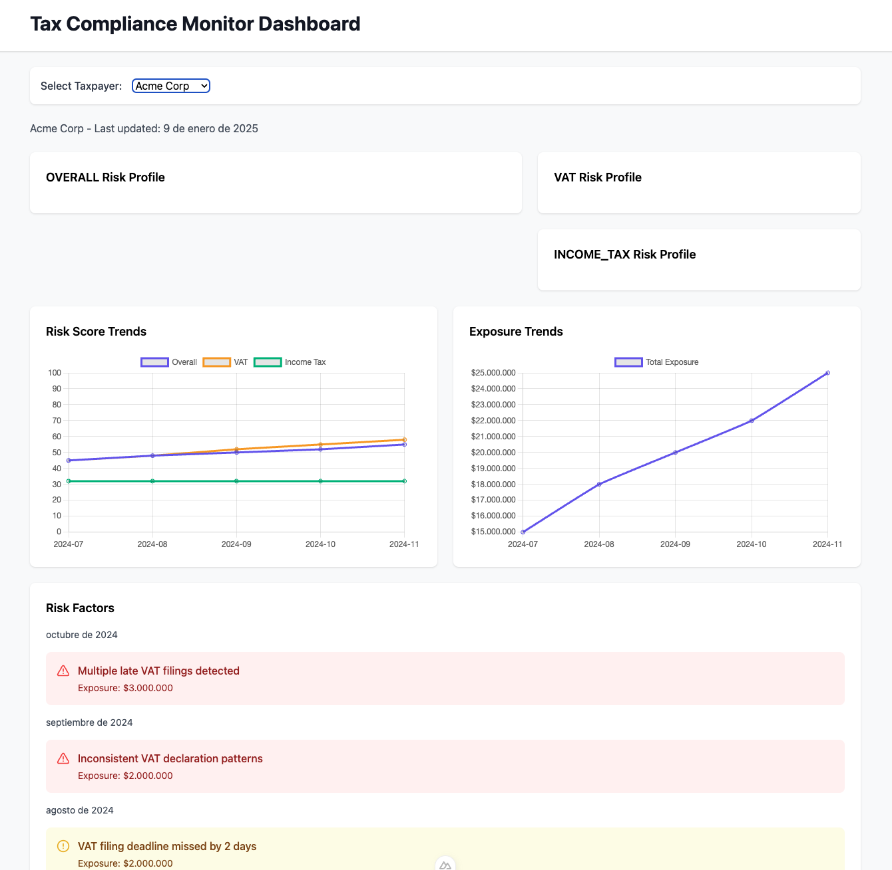
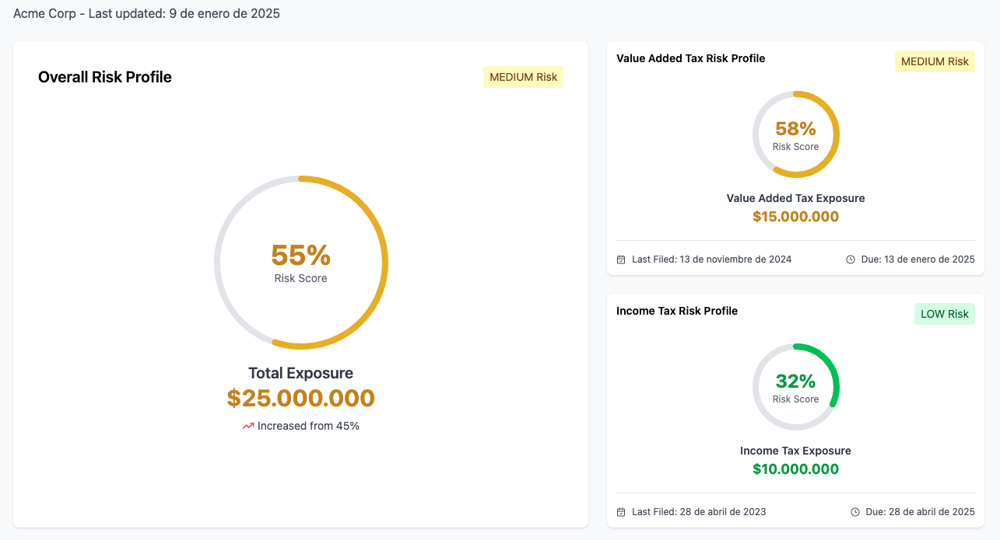

# Tax Compliance Monitor - Frontend Technical Assessment

## Overview
This Tax Compliance Monitor dashboard helps tax authorities identify and monitor high-risk taxpayers. The dashboard visualizes compliance risk through scores, trends, and key indicators.
Currently, the dashboard shows historical trends and filing data. Users can select taxpayers and view their risk history through charts that track both risk scores and monetary exposure over time.



## Frontend Task: Risk Profile Card
We need to add a quick-view risk profile card to complement the trend analysis. This card will display the current risk level through an intuitive gauge visualization component, along with exposure amounts and using the existing filing deadlines component.



### Core Requirements (6 hours)

1. RiskGauge Component (2.5h)
```typescript
// Visual indicator showing risk score with color-coded levels
interface Props {
  score: number;       // 0-100 risk score
  size?: CardSize;     // Display size variants
  colors: {            // Dynamic color scheme
    gauge: string;
    text: string;
  };
}
```
Acceptance Criteria:
- Circular gauge showing percentage
- Color changes based on risk level
- Supports multiple sizes (compact/default/large)
- Smooth value transitions

2. RiskCard Component (3h)
```typescript
// Container combining gauge, exposure, and filing info
interface Props {
  data: RiskCardData;  // Risk profile data
  size?: CardSize;     // Display size
}
```
Acceptance Criteria:
- Integrates RiskGauge component
- Displays exposure amounts
- Integrates risk trend component
- Integrates FilingInfo component for deadlines
- Responsive layout

3. Risk Utils (30min)
```typescript
// Risk calculation and styling helpers
type RiskLevel = 'LOW' | 'MEDIUM' | 'HIGH';
```
Acceptance Criteria:
- Risk level thresholds:
  - LOW: ≤ 40
  - MEDIUM: 41-70
  - HIGH: > 70
- Color scheme mapping

### Bonus Features
- Unit testing
- Loading/error states
- Performance optimizations
- Animation enhancements

## Development Setup

### Prerequisites
- Node.js ≥18
- Backend service running
- npm/yarn/pnpm

## Setup

```bash
npm install

# Environment setup
cp .env.example .env
# Set API_BASE url
```

## Environment Variables

```env
API_BASE=http://localhost:3001
```

## Development

```bash
# Development server
npm run dev

# Production build
npm run build

# Production start
npm run preview
# or
npm run start
```

Dashboard: http://localhost:3000

### Repository Structure
```
frontend/
├── components/          # Vue components
│   ├── TaxpayerSelector.vue   # Taxpayer selection
│   └── risk/
│       ├── FilingInfo.vue     # Filing dates display
│       ├── Trends.vue         # Working charts implementation
│       └── [your components]  # Implementation area
├── composables/        # Shared logic
├── constants/         # Theme and configuration
├── layouts/          # Page layouts
├── pages/            # Route pages
├── server/           # API routes
├── types/            # Type definitions
└── utils/            # Helpers and calculations
```

### Notes
- The Trends.vue component serves as an example of working chart implementation
- FilingInfo and RiskTrend components are available for reuse in RiskCard
- All required types are in the types/ directory
- API contract is documented in useRiskApi composable
- Data is made available in useRiskData composable
